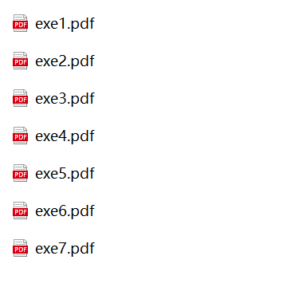
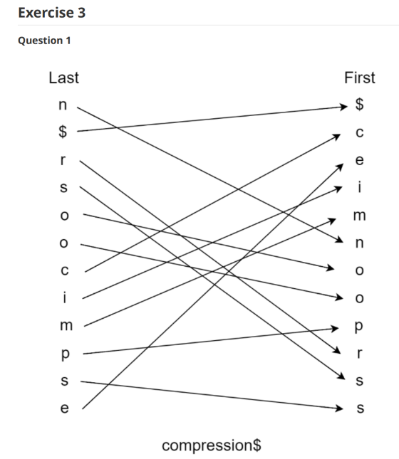
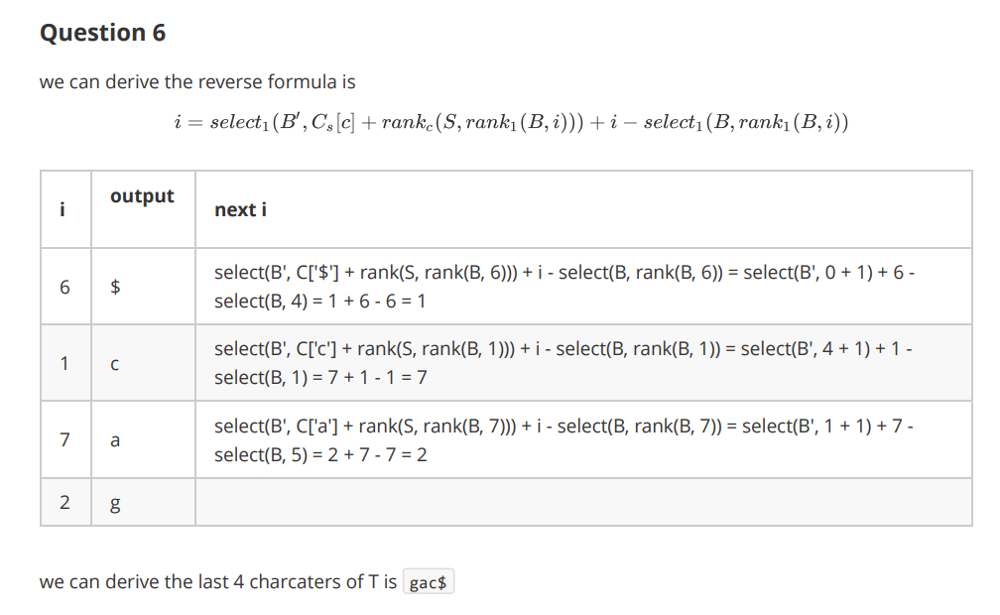
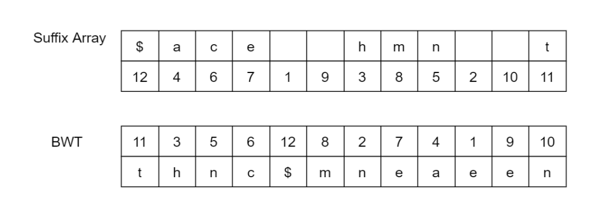

# UNSW_9319_exercise_sols

I'm glad you found this warehouse. You must have a **headache** for the final exam of **UNSW 9319 data compression**. If you want to learn clearly, you can only write the exercises provided by the teacher, but there is no detailed explanation. The answer is that you are very puzzled about the intermediate process, then you are right.

Download `sub.7z` in the folder and unzip it, you will get the following directory

It contains all the details of how to solve the given problems, some snapshorts are as follows:

What a great discovery, but you will find that a password is required when decompressing, which is a kind of protection for my hard work. I spent the whole week polishing this answer to ensure that the intermediate process is consistent with the professor , this answer is necessary to help you pass successfully or even pass with a high score. If you are interested, please contact me. All You need to pay for a meal to get such excellent assistance.
**vx: yalecheck**